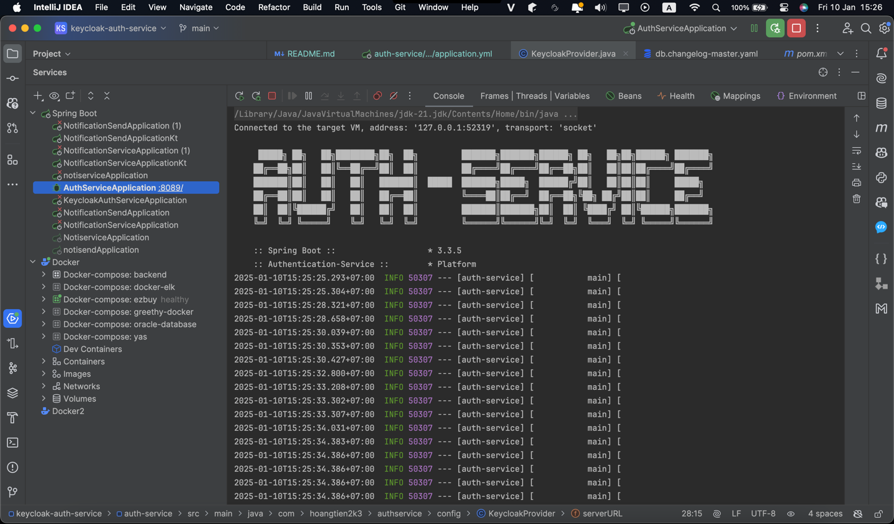
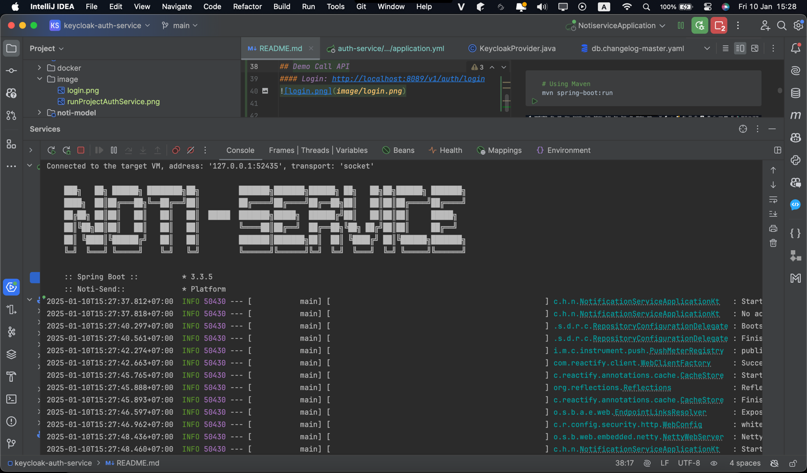
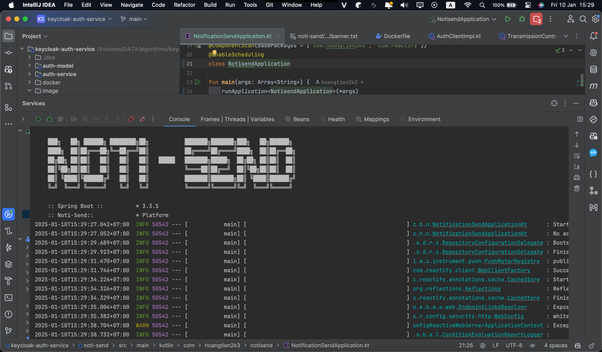
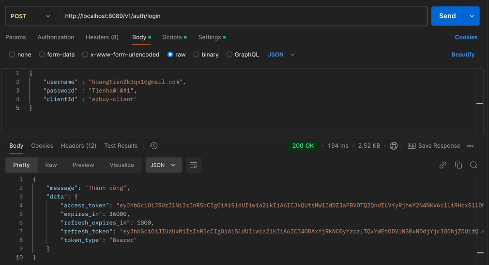
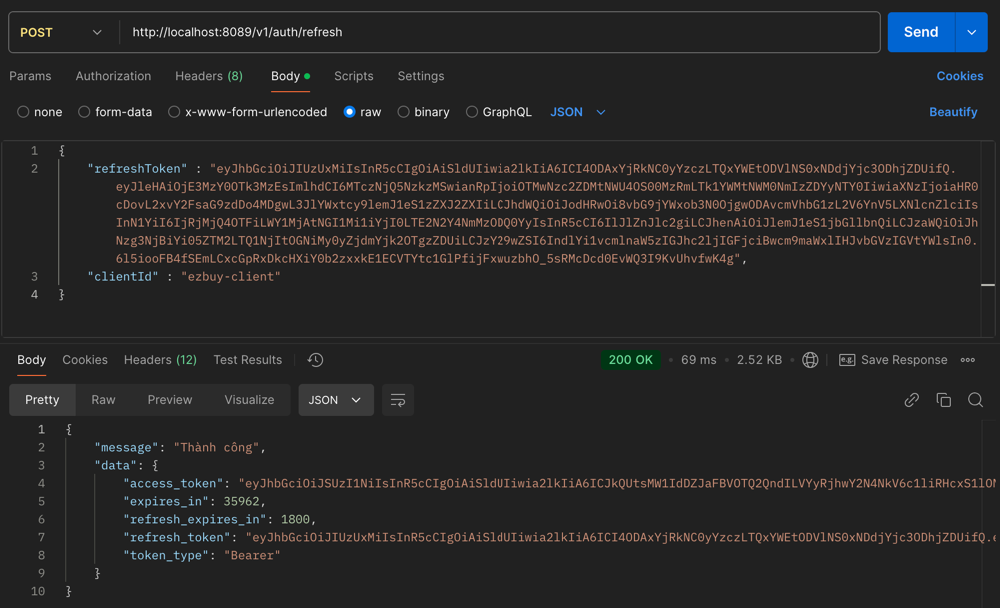

# keycloak-auth-service

## Getting Started
Follow these steps to set up and run the backend:
1. Clone the repository:
```yaml
git clone https://github.com/hoangtien2k3/keycloak-auth-service.git
```

2. Configure the database:
   - Create database `PostgreSQL` 
     - `auth-service` -> [File SQL](https://github.com/hoangtien2k3/keycloak-auth-service/blob/main/auth-service/src/main/resources/changelog/ddl/changelog-0001.sql) 
     - `noti-service` -> [File SQL](https://github.com/hoangtien2k3/keycloak-auth-service/blob/main/noti-service/src/main/resources/db.changelog/ddl/changelog-0001.sql)


3. Config file `application.yml`
   1. Change config file `application.yml` in `auth-service` and `noti-service`, `noti-send`
      - Config connect db R2DBC:
           - url: url: r2dbc:postgresql://localhost:5434/auth
           - username: admin
           - password: admin

      - Config keycloak:
           - clientId: 
           - clientSecret 
           - realm
           - serverUrl
           - grantType
           - host
    
4. Run each service in turn
```yaml
  # Using Maven
  mvn spring-boot:run
```






## Demo Call API
#### Login: http://localhost:8089/v1/auth/login


#### RefreshToken: http://localhost:8089/v1/auth/refresh



